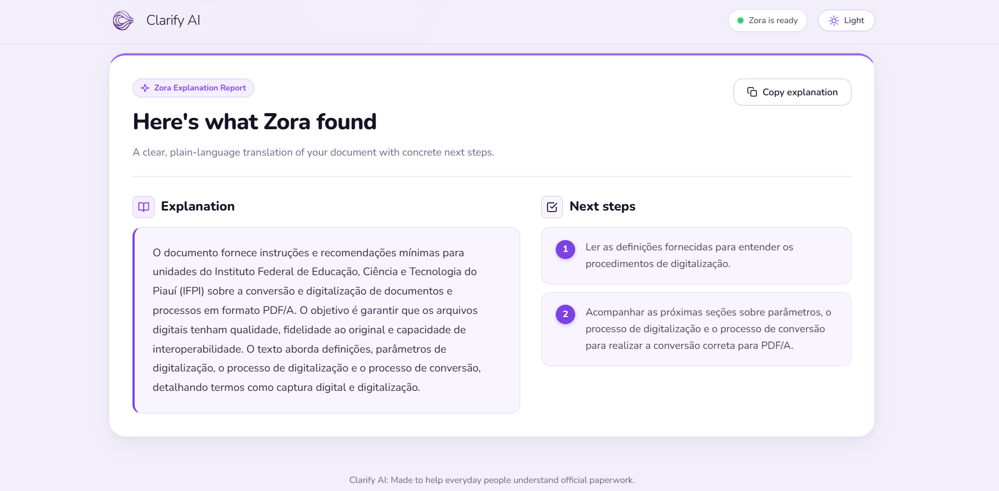

<div align="center">


# Clarify AI

_Understand what matters! Know what to do!_

 **From complicated documents to clear explanations and actionable next steps.**



<br>

[](https://gitdiagram.com/rayssaareis/bureaucracy-translator?utm_source=readme&utm_medium=badge)

</div>


## The Problem

Bureaucratic documents are everywhere.

Contracts, notices and forms often hide important information behind complex language and lengthy details.

Most people simply want to know:

* What does it mean?
* What do I need to do?
* What happens if I do nothing?

Understanding this can be crucial before signing or responding to a document.

**What if a document could explain itself?**

<br>

## From the Problem to Clarify AI

I work in real estate, where documents are part of everyday work.

Contracts, notices, forms and other documents are often filled with legal language and details that matter.

Over time, I noticed something simple: the person receiving the document often just wants to understand it.

That observation became the starting point for Clarify AI.

<br>

## How Clarify AI Works

Clarify AI turns a document into a clearer, more actionable explanation.

### Key Features

| Feature                   | What it does                                                           |
| ------------------------- | ---------------------------------------------------------------------- |
| **Text input**            | Analyze text directly without uploading a file                         |
| **Image input**           | Extract text from document images using OCR                            |
| **AI explanation**        | Transform complex content into a clearer explanation                   |
| **Actionable next steps** | Highlight what the user may need to do next                            |
| **Language support**      | Return the explanation in the document's original language or English  |
| **Simple interface**      | Focus on understanding the document, not navigating a complicated tool |

<br>

### From Document to Clarity

```text
┌─────────────────────┐
│      Document       │
│                     │
│  Complex language   │
│  Legal references   │
│  Important details  │
└──────────┬──────────┘
           │
           ▼
┌─────────────────────┐
│     Clarify AI      │
│                     │
│  OCR + AI analysis  │
└──────────┬──────────┘
           │
           ▼
┌─────────────────────┐
│      Clarity        │
│                     │
│  What it means      │
│  What to do next    │
└─────────────────────┘
```

Behind the interface, Clarify AI receives the user's input, processes the document when necessary, sends the relevant content through the AI pipeline, and returns a structured response containing an explanation and next steps.

<br>


## Under the Hood


[](https://gitdiagram.com/rayssaareis/bureaucracy-translator?utm_source=readme&utm_medium=picture)


### Request Flow

```text
User
  ↓
Frontend
  ↓
POST /api/translate
  ↓
Controller
  ↓
Service
  ↓
OCR / Gemini
  ↓
Response
```

The frontend communicates with the backend through a REST API.

The backend validates the request, determines whether the input is text or an image, processes the content when necessary, orchestrates the external services, and returns the final result to the frontend.

<br>

### Architecture

```text
┌──────────────────────────────┐
│           Frontend           │
│                              │
│  HTML + CSS + JavaScript     │
└──────────────┬───────────────┘
               │
               │ HTTP
               ▼
┌──────────────────────────────┐
│        Spring Boot API       │
│                              │
│        Controller            │
│             ↓                │
│          Service             │
│             ↓                │
│      External Clients        │
└────────────┬───────┬─────────┘
             │       │
             ▼       ▼
        OCR.space  Gemini
             │       │
             └───┬───┘
                 ▼
              Response
```

The backend follows a layered structure so that HTTP handling, business logic and external integrations remain separated.

<br>

### Technology Stack

| Layer        | Technology               |
| ------------ | ------------------------ |
| **Language** | Java 21                  |
| **Backend**  | Spring Boot 3            |
| **Build**    | Gradle                   |
| **API**      | REST                     |
| **Frontend** | HTML, CSS, JavaScript    |
| **OCR**      | OCR.space API            |
| **AI**       | Google Gemini API        |
| **Testing**  | JUnit + Spring Boot Test |

<br>

## OCR & AI Pipeline

For image-based documents, Clarify AI uses a two-stage processing pipeline:

```text
Image
  ↓
OCR.space
  ↓
Extracted text
  ↓
Gemini
  ↓
Explanation + Next Steps
```

For text input, the OCR step is skipped:

```text
Text
  ↓
Gemini
  ↓
Explanation + Next Steps
```

This keeps the processing path appropriate to the type of input received by the API.

<br>

## API

Clarify AI exposes its own REST endpoint:

```http
POST /api/translate
```

The endpoint accepts exactly one input type:

* `text`
* `image`

It also accepts:

```text
targetLanguage = original | en
```

<br>

#### Text request

```bash
curl -X POST http://localhost:8080/api/translate \
  -F "text=Your document text here" \
  -F "targetLanguage=original"
```

#### Image request

```bash
curl -X POST http://localhost:8080/api/translate \
  -F "image=@document.png" \
  -F "targetLanguage=original"
```

#### Success response

```json
{
  "explanation": "A clear explanation of what the document means.",
  "nextSteps": [
    "Review the requested information.",
    "Respond before the indicated deadline."
  ]
}
```

#### Error response

```json
{
  "error": "Description of the error."
}
```

### Testing

The project includes automated tests covering the main backend behavior and external client integrations.

Run the complete test suite with:

```bash
./gradlew clean test
```

On Windows:

```powershell
.\gradlew.bat clean test
```

The test suite covers request validation, controller behavior, OCR integration behavior, Gemini integration behavior, malformed responses, HTTP failures and network failures.

## Run It Yourself

### Prerequisites

Before running Clarify AI locally, you need:

* Java 21
* A Gemini API key
* An OCR.space API key
* Internet access for the external API integrations

The application uses external AI and OCR services, so their respective API access and usage limits apply.

### Setup

Clone the repository:

```bash
git clone https://github.com/rayssaareis/bureaucracy-translator.git
cd bureaucracy-translator
```

Configure the required environment variables.

#### Windows PowerShell

```powershell
[Environment]::SetEnvironmentVariable("GEMINI_API_KEY", "your-gemini-key", "User")
[Environment]::SetEnvironmentVariable("OCR_SPACE_API_KEY", "your-ocr-space-key", "User")
```

Restart the terminal after configuring the variables.

You can verify that the variables are available with:

```powershell
$env:GEMINI_API_KEY
$env:OCR_SPACE_API_KEY
```

Do not commit API keys or other secrets to the repository.

### Run

Start the application with:

```bash
./gradlew bootRun
```

On Windows:

```powershell
.\gradlew.bat bootRun
```

Then open:

```text
http://localhost:8080
```

### Test

Run the complete automated test suite:

```bash
./gradlew clean test
```

On Windows:

```powershell
.\gradlew.bat clean test
```

## Project Structure

```text
bureaucracy-translator/
│
├── docs/
│
├── gradle/
│   └── wrapper/
│
├── src/
│   ├── main/
│   │   ├── java/
│   │   │   └── com/
│   │   │       └── bureaucracytranslator/
│   │   │           ├── client/
│   │   │           ├── config/
│   │   │           ├── controller/
│   │   │           ├── dto/
│   │   │           ├── exception/
│   │   │           └── service/
│   │   │
│   │   └── resources/
│   │       ├── static/
│   │       │   ├── assets/
│   │       │   ├── css/
│   │       │   ├── js/
│   │       │   └── index.html
│   │       └── application.properties
│   │
│   └── test/
│       └── java/
│
├── gradlew
├── gradlew.bat
└── README.md
```

## Design Decisions

### Separate the frontend from the processing logic

The frontend is responsible for the user experience and communicating with the API.

The backend owns validation, processing and integration with external services.

### Use a dedicated service layer

Business logic is kept outside the controller so that HTTP concerns do not become tightly coupled to document processing.

### Isolate external integrations

OCR and Gemini communication are handled through dedicated clients.

This makes external service behavior easier to test and keeps the core application logic independent from implementation details.

### Return structured results

Instead of returning an unstructured block of generated text, the API returns:

```json
{
  "explanation": "...",
  "nextSteps": []
}
```

This gives the frontend predictable data to render and keeps the distinction between understanding the document and deciding what to do next.

### Keep credentials outside the codebase

API credentials are provided through environment variables rather than being stored directly in source code.

<br>

## Roadmap

Potential future improvements include:

* Support for additional document formats
* More advanced document structure detection
* Improved multilingual support
* Conversation history for document analysis
* More granular explanations of specific sections
* Additional accessibility improvements
* More robust observability and monitoring

<br>

## Hackathon

Clarify AI was built as a hackathon project with a simple goal:

**Make complex information easier to understand and act on.**

*Built as a hackathon project. <3*

<br>

## License

Clarify AI is a hackathon project created by Rayssa Reis.

The project is shared for educational and portfolio purposes. No open-source license has been applied at this time.
